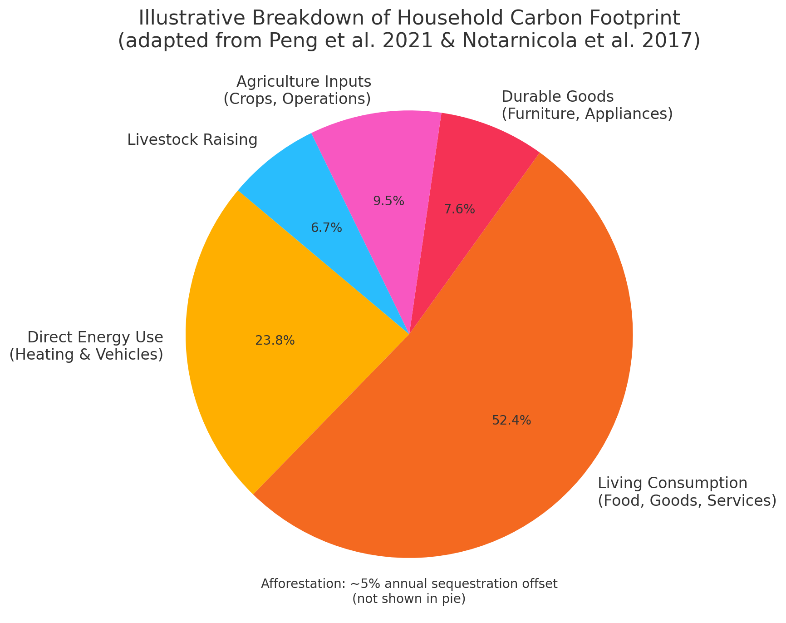

<!-- Slide 1 -->
# Modeling Household Carbon Footprints: Methods, Metrics, and Estimation Frameworks  
### Master’s Thesis  
Anushka Mukherjee  · 50075072
University of Bonn 
July 2025

  Anushka Mukherjee — Master’s Thesis - July 2025

---

<!-- Slide: Motivation -->
## Motivation

- Households are often portrayed as **central actors** in reducing emissions.
- However, current carbon footprint tools:
  - Rely on **inconsistent system boundaries**
  - Often **double-count emissions**
  - Fail to account for **market feedback** or **investment-induced emissions**
- This leads to:
  - **Misattribution of responsibility**
  - **Ineffective climate policies** targeting only consumer behavior

 **Goal**: Provide a more accurate, systemic method to assess household carbon footprints by comparing four key models.

  Anushka Mukherjee — Master’s Thesis - July 2025
    Introduction · Slide 2/21

---

<!-- Slide: Research Questions -->
## Research Questions

1.  How do footprint estimates vary across methods when applied to real household data?  
  

2. How does each carbon accounting method estimate and attribute responsibility for household carbon footprints?  
 

3. How do these attribution methods influence policy, and what are the equity implications of their application?

---
<!-- Slide: Analytical Approach -->
## Analytical Framework

- Construct a comparative framework to analyze household carbon attribution under four distinct paradigms:  
  1. GHG Protocol (emissions inventory)  
  2. Life Cycle Assessment (process-based)  
  3. Environmentally Extended Input-Output (EEIO)  
  4. Hakenes & Schliephake (HS) equilibrium model
---
## Methodology
 **Analytical Focus**  
- Formalize each model's attribution logic  
- Examine embedded assumptions about causality, substitutability, spillovers, and investment
- Calibrate empirical model inputs using real household expenditure data

 **Integrated Evaluation**  
- Quantitatively compare model outputs  
- Assess theoretical robustness, policy responsiveness, and distributional fairness

---
<!-- Slide: GHG Protocol -->
## GHG Protocol: Emissions Inventory Approach

**Conceptual Basis**  
- Emission factor–based framework structured around **Scopes 1, 2, and 3**  
- Emissions tied to direct consumption (Scope 1), purchased energy (Scope 2), and supply chain + investment (Scope 3)  
- Attribution logic: **operational control** → responsibility is tied to observable, household-level activities
---
**Empirical Illustration (Spain, 2022)**  
- **Data**: INE household expenditure + IPCC/IDAE emission factors  
- **Method**:   
  $$ \text{CF}_{\text{household}} = E_{\text{Scope 1}} + E_{\text{Scope 2}} + E_{\text{Scope 3}}; \, with\;

   E_{\text{Scope j}} = \sum_i (Q_{\text{j}} \cdot EF_{\text{j}})$$

- **Results**:  
  – Direct fuel use and electricity dominate emissions  
  – Scope 3 (value-chain, investment) often underreported or inconsistently applied
- **Limitation**:  
Fails to capture market feedback or inter-household spillovers. Assumes static attribution without systemic response.

---
<!-- Slide: Life Cycle Assessment (LCA) -->
## Life Cycle Assessment (LCA)

**Conceptual Basis**  
- Calculates emissions across the **entire lifecycle** of a product or service  
  – From resource extraction to production, use, and disposal  
- Attribution logic: **Responsibility embedded in the product**  
- Based on **process-specific emission factors** (kg CO₂e/unit)

---
<!-- Slide: Life Cycle Assessment (LCA) – Full Model -->
##  Model: Hybrid LCA framework 
$$
\begin{align*}
\text{CF}_{\text{total}} =\ 
& \sum_d (F_{id} \cdot EF_d) + \sum_f (EF_f \cdot C_{if}) + \sum_j \left( \frac{EF_j \cdot C_{ij}}{L_j} \right) \\
& + \sum_a (EF_a \cdot M_{ia}) + \sum_t (EF_t \cdot FS_{ia}) + \sum_v (B_v \cdot 0.475) \\
& - \sum_{iaf} (FS_{iaf} \cdot CS_{\text{citrus}}) + \sum_f (EF_{if} \cdot F_{if}) + \sum_l (EF_{il} \cdot N_{il})
\end{align*}
$$
Adapted from Peng et al. (2021), Matthews et al. (2008), Steubing et al. (2022), this model captures emissions and sequestration from:
- **Direct energy use**, **consumer goods**, **agriculture**, **land use**, and **livestock**  
- Designed to reduce truncation error by combining process data with macroeconomic linkages
---

**Findings (from Peng et al., Matthews et al., Notarnicola et al.)**

---

> Indirect emissions embedded in consumer goods **dominate** household footprints, revealing structural limits of behavior-based mitigation.

\
 **Limitations**  
- Lacks systemic view → **ignores upstream spillovers and macroeconomic feedback**
- Sensitive to **data gaps** and **sectoral aggregation**
---

<!-- Slide: EEIO – Model and Structure -->
## Environmentally Extended Input–Output (EEIO) Model
  
- EEIO links **household final demand** to economy-wide GHG emissions via inter-industry relationships  
- Captures **direct and indirect emissions** through production chains  
- Based on **Leontief production theory** and sector-specific emission intensities

---
<!-- Slide: EEIO – Tiered Decomposition -->
## EEIO: Tiered Decomposition of Household Emissions

The household carbon footprint is analytically decomposed into three emission tiers:

$$
\textbf{E}_1 = \textbf{C}_d \cdot \textbf{F}_d \quad \text{(Tier 1: Direct Emissions)}
$$

$$
\textbf{E}_2 = \textbf{C}_e \cdot (\textbf{I} - \textbf{A})^{-1} \cdot \textbf{F}_e \quad \text{(Tier 2: Indirect Energy)}
$$

$$
\textbf{E}_3 = \textbf{C} \cdot \left[(\textbf{I} - \textbf{M})(\textbf{I} - \textbf{A})\right]^{-1} \cdot \left[(\textbf{I} - \textbf{M}) \cdot \textbf{F} + \textbf{EX} \right] \quad \text{(Tier 3: Supply Chain)}
$$
\
**Total Household Footprint**  
$$
\textbf{E}_{\text{total}} = \textbf{E}_1 + \textbf{E}_2 + \textbf{E}_3
$$
\
Source: Matthews et al. (2008), Long et al. (2019)

---

<!-- Slide: EEIO – Empirical Illustration -->
## EEIO – Empirical Illustration (Tier 3)

**Method**  
- Environmentally extended emission intensities $( EF_i)$ (kg CO₂e/€) derived from **EXIOBASE** via Climatiq.io applied to 2021 **household final consumption** from **Eurostat** for France, Spain, and Germany  
- Incorporated Leontief inverse $L = (\mathbf{I} - \mathbf{A})^{-1}$ and direct sectoral intensities $C_j$ :  
$$
EF_i = \sum_j C_j \cdot L_{ji}
$$
- Final household emissions computed as:  
$$
E_{i,c} = F_{i,c} \cdot EF_i$$

> No import share matrix applied; upstream emissions embedded via EXIOBASE coefficients

---

📉 **Results Summary (2021)**

| Country   | Household Expenditure (€ bn) | Emissions (Mt CO₂e) |
|-----------|-------------------------------|----------------------|
| France    | 1322.0                        | 420.0                |
| Spain     | 747.9                         | 227.0                |
| Germany   | 1794.8                        | 545.9                |

> Housing, food, and transport jointly contribute >60% of household footprints across all countries  

Sources: Eurostat 2021, EXIOBASE 2025, Matthews et al. (2008), Sheng et al. (2024)

---

<!-- Slide: HS Model – Framework -->
## Hakenes–Schliephake (HS) Model: Equilibrium-Based Attribution

- Partial general equilibrium model where households choose consumption $( q_h)$ and investment $(i_h)$ under budget and preference constraints.  
- Each household’s choices affect aggregate demand, equilibrium prices, and output.
- **Emissions are attributed through marginal causal responsibility and market spillovers** rather than direct accounting.

**Key Equation**  
$$
\text{CF}_h = x \left( \phi q_h + (1 - \phi) \frac{i_h}{c} \right) \, where ,\

\phi = \frac{b}{b + c^2 \alpha \sigma^2}
$$  

Source: Hakenes & Schliephake (2024)

---

<!-- Slide: HS – Empirical Illustration -->
## HS Model – Empirical Illustration: U.S. Wheat Sector

**Setup**  
- Market: U.S. wheat sector (2010–2017), USDA data  
- Approach: Simulated a 15.6% supply shock using:
  – **Empirical OLS-estimated supply curve**  
  – **Theoretical supply curve** derived from HS model assumptions  
- Demand curve: Held constant, calibrated to historical elasticity

---

 **Empirical Supply (OLS):**  
- Captures historic price–quantity response  
-  OLS regression on production and farm prices  
-  Emissions computed using:
$$
E = Q \cdot \epsilon \quad \text{where } \epsilon = 10.88~\text{kg CO₂e/bushel}
$$

 **Theoretical Supply (HS):**  
-  Derived from investment behavior under risk:
$$
P(Q) = c(r_f - \lambda) + \frac{c^2 \alpha \sigma^2}{n - 1} Q
$$  
> Parameters taken from agri-financial data $c = 4$, $r_f = 0.05$, $\alpha = 0.5$, $\sigma = 0.4$, $n = 100{,}000$

---

 *Comparative supply curve plots*
 
> Panel A: Empirical | Panel B: Theoretical  
> Y-axis: Price (USD), X-axis: Quantity (mill. bushels)

---

<!-- Slide: HS – Footprint Results -->
**Results**
<table style="font-size: 90%; width: 100%;">
  <tr>
    <th>Scenario</th>
    <th>Equilibrium Quantity (mill. bushels)</th>
    <th>Price (USD)</th>
    <th>Carbon Footprint (mill. kg CO₂e)</th>
  </tr>
  <tr><td>Empirical – Before Shock</td><td>2100.71</td><td>5.58</td><td>22,859.68</td></tr>
  <tr><td>Empirical – After Shock</td><td>2068.38</td><td>5.82</td><td>22,500.32</td></tr>
  <tr><td>Δ Empirical</td><td>—</td><td>—</td><td><b>–359.36</b></td></tr>
  <tr><td colspan="4"></td></tr>
  <tr><td>Theoretical – Before Shock</td><td>2112.45</td><td>5.69</td><td>22,983.46</td></tr>
  <tr><td>Theoretical – After Shock</td><td>2096.36</td><td>5.99</td><td>22,808.40</td></tr>
  <tr><td>Δ Theoretical</td><td>—</td><td>—</td><td><b>–175.06</b></td></tr>
</table>

Source: Hakenes & Schliephake (2022); Author’s simulation with USDA and FAO data

---

<!-- Slide: HS – Interpretation Only -->
<!-- Slide: HS – Illustration-Based Interpretation -->
**Why Does the HS Model Predict a Smaller Emission Reduction?**

The HS framework is derived from **forward-looking household investment under uncertainty**.  
→ Capital is reallocated dynamically based on risk, return expectations, and marginal utility.  
→ This **buffers the shock**, resulting in a more elastic supply response and a smaller drop in equilibrium output.
→  It attributes emissions based on how decisions alter equilibrium outcomes—not just observed market behavior.  
→ This explains the muted emission response despite identical external shocks.

---
<!-- Slide: Technical Attribution Logics -->
### Attribution Logics in Carbon Accounting

The assignment of household responsibility varies by modeling framework, reflecting divergent assumptions about agency, causality, and system boundaries:

- **Operational-based (GHG Protocol):**  
  → Excludes upstream and embodied emissions.  
  → Suitable for regulatory policies and sectoral compliance.

- **Consumption-based (LCA, EEIO):**  
  → Includes full upstream supply chain emissions.  
  → Assumes proportional agency through consumption patterns.

- **Consequentialist (HS Model):**  
  → Incorporates equilibrium adjustments, spillovers, and price effects.  
  → Emphasizes causal agency and avoids double-counting.

---

<!-- Slide: Technical Attribution Comparison -->
## Analytical Consequences of Attribution Choices

| Attribution Logic    | Model            | Causality Structure             | Behavioral Sensitivity | System Feedbacks | Scope of Responsibility |
|----------------------|------------------|----------------------------------|-------------------------|------------------|--------------------------|
| Operational Control  | GHG Protocol     | Agent emits                      | Low                     | None             | Narrow (10–20%)          |
|      Consumption Based    | LCA              | Final Demand                   | Medium                  | Partial (fixed tech) | Broad (60–70%)          |
| Consumption Based      | EEIO             | Agent allocates expenditure      | High (monetary)         | None (linear)     | Broad (60–70%)           |
| Consequentialist Impact      | HS Model         | Agent alters equilibrium         | Endogenous              | Full GE closure  | Contingent (φ-weighted)  |

---
<!-- Slide: Policy Introduction – Emission Inequality -->
## Emission Inequality and Constraints on Household Decarbonization

Household emissions are **heterogeneous across regions and income groups**:
- EU households show regional variation due to **electricity mix** and **consumption profiles**  
  → Lower per capita emissions in Eastern Europe; lower carbon intensity in France and Norway 

- Globally, **top 10% of income earners** are responsible for ~50% of lifestyle emissions  
  → Poorest 50% account for only ~10% (Gore & Alestig, 2020)

---

  

  

     <strong>Implication</strong>:  
    Uniform policy tools risk being regressive or ineffective without accounting for:
    <ul>
      <li>Structural inequalities in energy systems and asset ownership</li>
      <li>Variability in consumption elasticity and marginal abatement potential</li>
    </ul>
    ➝ Policy design must reflect <strong>emissions attribution logic</strong>, income heterogeneity, and context-specific constraints.
  

---
<!-- Slide: Attribution–Policy–Equity Diagram -->
## From Attribution to Policy and Equity Outcomes

---

<!-- Slide: Conclusion -->
## Conclusion: Attribution Logic Shapes Measurement, Responsibility, and Policy

- This study systematically evaluated four carbon accounting frameworks—GHG Protocol, LCA, EEIO, and Hakenes–Schliephake (HS)—through the lens of household responsibility attribution.

### Core Findings

- **Attribution Structure Determines Footprint Magnitude**  
  Emission estimates vary significantly across methods:  
  – Control-based (GHG) yields narrow scopes (10–20%)  
  – Consumption-based (LCA, EEIO) assign 60–70% to households  
  – HS model attributes only the *marginal causal share* under equilibrium
---
- **Only the HS Model Internalizes Market Feedbacks**  
  → Captures systemic spillovers via consumption and investment channels  
  → Avoids double-counting; reflects risk-adjusted, behavioral dynamics

 - **Policy instruments align with attribution logic**:  
  – GHG Protocol: carbon taxes (Scopes 1–2), direct energy regulation  
  – LCA: product and appliance standards, eco-design policies  
  – EEIO: consumption-based taxation, border carbon adjustments  
  – HS: investment-based instruments, green financial regulation

📌 Attribution is not neutral—it embeds normative assumptions about agency and influence.  
**Methodological choice prefigures both measurement outcomes and mitigation pathways.**

